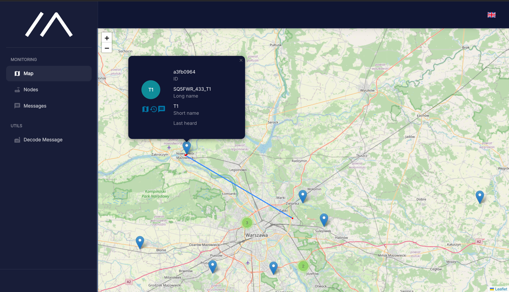
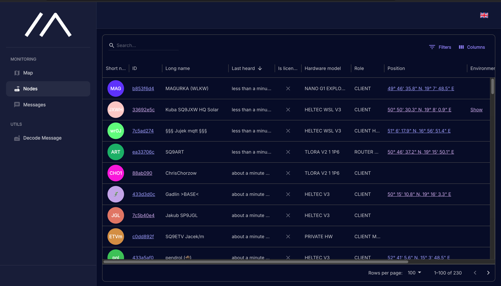
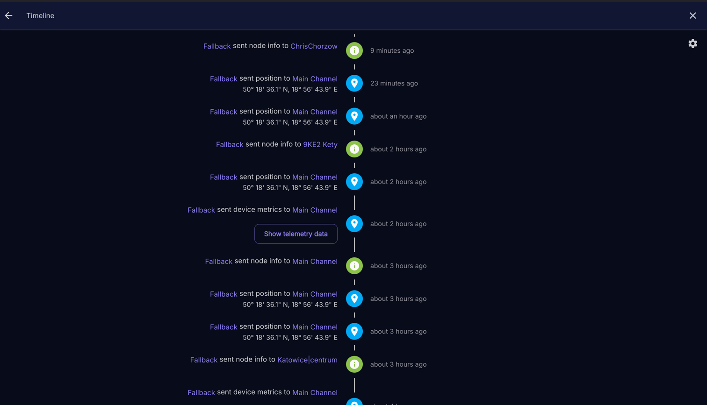
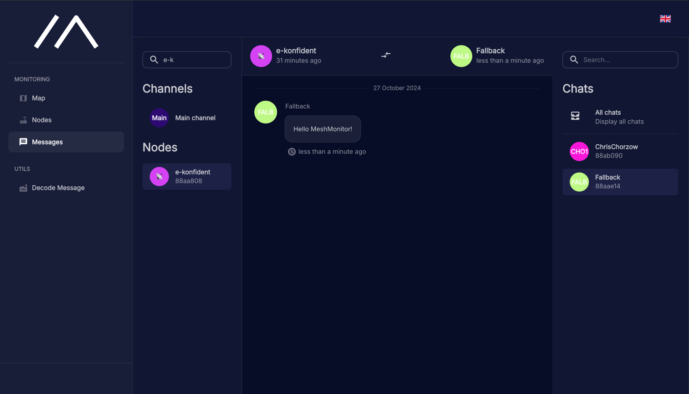

# MeshMonitor 
MeshMonitor is a tool to monitor the status of a [meshtastic](https://meshtastic.org/) network. 
This tool logging all Mesh messages to a database and provides a web interface to view the data.

## Technology used
- [SurrealDB](https://github.com/surrealdb/surrealdb)
- [MQTT (mosquitto)](https://github.com/eclipse-mosquitto/mosquitto)
- [Bun](https://github.com/oven-sh/bun)
- [Nginx](https://github.com/nginx/nginx)

## Supported languages
- Polish
- English
- Czech
- Swedish
- German
- Spanish
- French

## Demo
Demo is available under [meshmonitor.org](https://meshmonitor.org/)

## Screenshots

|  |        |
|--------------------------------|-----------------------------------------------|
|  |  |

## Packages

### Worker
Process that listens to the MQTT broker and logs all messages to the SurrealDB database.

ENV variables:

| ENV Name              | Default Value      | Description                                                          |
|-----------------------|--------------------|----------------------------------------------------------------------|
| `MQTT_HOST`*          | `required`         | The hostname to MQTT server                                          |
| `MQTT_PORT`           | `1883`             | The port number for the MQTT connection.                             |
| `MQTT_USERNAME`       | `null`             | The username for accessing the MQTT.                                 |
| `MQTT_PASSWORD`       | `null`             | The password for the MQTT user.                                      |
| `MQTT_SUBSCRIPTIONS`  | `predefinedValues` | Comma seperated topics, like +/2/e/#,+/+/2/e/# etc. Not need to fill |
| `DB_HOST`*            | `required`         | The name of the database to connect to.                              |
| `DB_PORT`             | `8000`             | Port to database                                                     |
| `DB_USERNAME`         | `root`             | Username to database                                                 |
| `DB_PASSWORD`*        | `required`         | Password to database                                                 |
| `DB_NAME`             | `meshtastic`       | Database name                                                        |
| `DB_NAMESPACE_PUBLIC` | `public`           | Namespace name                                                       |

### Frontend
Web interface to view the data.

ENV variables:

| ENV Name             | Default Value              | Description                                                                       |
|----------------------|----------------------------|-----------------------------------------------------------------------------------|
| `REACT_DB_HOST`*     | `current hostname`         | Hostname to SurrealDB                                                             |
| `REACT_DB_PORT`      | `current port - 443 or 80` | Port to SurrealDB                                                                 |
| `REACT_DB_PATH`      | `/db/rpc`                  | Path to RPC. When using SurrealDB directly, without Nginx proxy - just set `/rpc` |
| `REACT_DB_NAME`      | `meshtastic`               | Database name                                                                     |
| `REACT_DB_USERNAME`  | `public`                   | Public database user                                                              |
| `REACT_DB_PASSWORD`* | `public`                   | Public database password                                                          |
| `REACT_DB_NAMESPACE` | `public`                   | Public namespace                                                                  |

### AutoTranslate
AutoTranslate is a tool to automatically translate frontend project to other languages. It takes as a base English language and translates it to desired languages.

ENV variables:

| ENV Name          | Default Value | Description       |
|-------------------|---------------|-------------------|
| `OPENAI_API_KEY`* | `required`    | API key to OpenAi |

### docker-helper
Mini project, what takes ENV variables and generates config.js file, which is used in the frontend project.

## Running locally via docker
1. Clone the repository
2. Run `cp .env.docker.example .env.docker` and update values in .env.docker file like your MQTT credentials and default root password to database
3. Run 'set -a && source .env.docker && docker compose up --build'
4. Open `http://localhost:8080` in your browser

## Running development
1. Clone the repository
2. Run `cp .env.example .env` and update values in .env file like your MQTT credentials and default root password to database
3. Run `set -a && source .env`
4. Run `bun run worker:dev start` to start worker
5. In other window `bun run frontend:dev` to start frontend